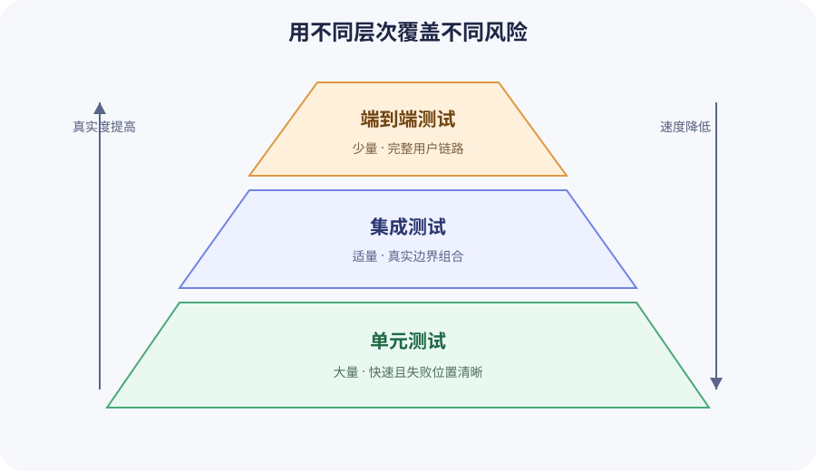

# 基础测试

自动化测试用可执行的例子描述程序应该怎样工作。它不能证明软件没有任何缺陷，但可以快速发现已经被覆盖的行为何时发生变化。好的入门测试不追求数量或覆盖率数字，而是优先保护重要行为、边界条件和已知失败模式。

本课程使用 pytest 演示。测试思想同样适用于其他语言和框架。

## 1. 从行为开始，而不是从函数开始

行为是程序在给定条件和输入下，对调用者或外部世界表现出的可观察结果。它不只包括返回值，还可能包括：

- 抛出明确的异常。
- 改变对象、文件或数据库中的状态。
- 调用一个外部边界，例如 HTTP 客户端或消息队列。
- 产生具有业务或运维意义的日志与事件。

相比之下，局部变量的取值、私有辅助函数的调用顺序、循环执行次数和具体采用的字符串方法，通常属于实现细节。除非这些细节本身就是明确契约，否则测试不应依赖它们。

先从需求中提取行为规则：

> 给定三篇文档，当用户搜索 `RAG` 时，返回标题或正文包含该词的文档，并且不区分大小写。

它比“测试 `search_documents()` 函数”更有方向，因为它说明了前置条件、输入、可观察结果和重要规则。可以按照以下顺序把需求变成测试：

1. 找出规则：大小写差异不应改变搜索结果。
2. 选择场景：文档包含 `RAG`，查询词使用小写 `rag`。
3. 确定观察点：检查返回的文档，而不是检查内部调用了哪个字符串方法。
4. 命名测试：名称同时说明条件和预期行为。

这条推导链可以写成：

```text
需求：搜索不区分大小写
行为：大小写不同的等价查询得到相同结果
场景：文档包含 “RAG”，用户查询 “rag”
测试：test_search_is_case_insensitive
```

“从行为开始”与“从函数开始”的区别主要体现在测试问题上：

| 出发点 | 测试提出的问题                        | 结果                                 |
| ------ | ------------------------------------- | ------------------------------------ |
| 函数   | `search_documents()` 是否调用了某方法 | 容易绑定当前实现，正常重构也可能失败 |
| 行为   | 查询大小写不同时是否仍返回同一篇文档  | 保护对外契约，允许内部实现独立演进   |

确定场景以后，可以使用 Arrange、Act、Assert 组织测试代码：

```python
def test_search_is_case_insensitive():
    # Arrange
    documents = [Document(title="RAG Guide", content="...", source="guide.md")]

    # Act
    results = search_documents(documents, "rag", request_id="test-request")

    # Assert
    assert [result.document.title for result in results] == ["RAG Guide"]
```

Arrange 准备前置条件，Act 执行被测行为，Assert 检查可观察结果。它只负责组织已经确定的场景，不能代替需求分析。注释也不是固定要求；当测试足够短时，空行就能表达三个阶段。

“不要从函数开始”并不是说不能直接测试函数。函数仍然可以是测试入口；如果一个辅助函数具有独立、稳定并且对调用者有意义的契约，直接测试它也完全合理。这里反对的是按照源码中的函数或代码行机械分配测试，而没有先说明要保护什么行为。

一个函数可能承载多个行为，因此通常需要多个测试；一个行为也可能由多个函数协作完成，因此不一定对应某个单独函数。测试名称应说明条件和预期结果，例如 `test_search_is_case_insensitive`，而不是只写 `test_search_1`。

## 2. 测试哪些情况

每个行为至少考虑三类输入：

- 正常路径：典型输入得到预期结果。
- 边界条件：空列表、空字符串、零、最大限制、重复值、Unicode 或临界时间。
- 失败路径：无效输入、文件损坏、超时或外部服务错误产生明确异常或降级结果。

不要为每一行实现机械地写一个测试。优先覆盖“如果坏了会影响用户或难以定位”的行为。文档搜索的首批测试可以是：

| 场景         | 预期行为                                 |
| ------------ | ---------------------------------------- |
| 标题命中     | 返回对应文档                             |
| 正文命中     | 返回对应文档                             |
| 大小写不同   | 仍然命中                                 |
| 没有命中     | 返回空列表，而不是抛出无关异常           |
| 空查询       | 抛出 `ValueError` 并记录受控的 `WARNING` |
| `limit` 为 0 | 明确拒绝，而不是悄悄返回空列表           |

## 3. 单元、集成与端到端测试



| 层次       | 验证范围                          | 优点                   | 局限                     |
| ---------- | --------------------------------- | ---------------------- | ------------------------ |
| 单元测试   | 一个函数、类或小模块              | 快、失败位置清晰       | 不能证明组件连接正确     |
| 集成测试   | 数据库、文件系统、HTTP 客户端组合 | 更接近真实边界         | 较慢，环境准备更复杂     |
| 端到端测试 | 从外部入口到最终结果的完整流程    | 验证用户真正经过的链路 | 慢，失败原因通常更难定位 |

测试组合通常是大量快速单元测试、适量集成测试和少量关键端到端测试。这里的“测试金字塔”是取舍提示，不是固定比例。若系统主要风险来自数据库查询或模型 API 契约，就应投入足够的集成与契约测试。

RAG 还需要评测检索与生成质量。基础测试适合验证解析函数、API schema、拒答规则和已知回归；Recall@K、答案忠实度等质量指标需要固定数据集和评测流程，不能用几个普通单元测试代替。

## 4. pytest 的发现与断言

pytest 默认发现 `test_*.py` 或 `*_test.py` 文件中的 `test_*` 函数。配套项目的测试应在该项目根目录执行；这里指 `projects/engineering-foundations`，而不是整个仓库的根目录。首次运行前先同步项目及其开发依赖，然后使用项目虚拟环境中的 pytest 运行全部测试：

```shell
cd projects/engineering-foundations
uv sync
uv run pytest
```

这三条命令分别完成不同工作：

- `cd projects/engineering-foundations`：进入包含该项目 `pyproject.toml` 的根目录。
- `uv sync`：按照 `pyproject.toml` 和 `uv.lock` 创建或同步 `.venv`，并安装 pytest 等开发依赖；它只准备环境，不运行测试。
- `uv run pytest`：使用该项目的 `.venv` 执行 pytest，发现并运行当前项目的全部测试。

只运行一个文件、一个测试或名称匹配的测试：

```shell
uv run pytest tests/test_search.py
uv run pytest tests/test_search.py::test_empty_query_is_rejected
uv run pytest -k "empty_query"
```

pytest 使用普通 `assert`，失败时会展示实际值与预期值：

```python
assert result.title == "RAG Guide"
assert len(results) == 2
assert {result.source for result in results} == {"a.md", "b.md"}
```

只有顺序属于契约时才断言列表顺序；否则可以比较集合。不要把多个无关行为塞进一个测试，因为第一个断言失败后，后续断言不会执行。

## 5. 参数化：同一规则，多组输入

当多组输入验证同一规则时，使用 `pytest.mark.parametrize`：

```python
import pytest


@pytest.mark.parametrize("query", ["RAG", "rag", " Rag "])
def test_search_normalizes_query(sample_documents, query):
    results = search_documents(sample_documents, query, request_id="test-request")

    assert results[0].document.title == "RAG Guide"
```

`parametrize` 的第一个参数 `"query"` 是要注入测试函数的参数名，必须与函数签名中的 `query` 一致；第二个参数是该参数依次使用的值。pytest 会把上面的定义展开成三个互相独立的测试用例：

```text
test_search_normalizes_query[RAG]
test_search_normalizes_query[rag]
test_search_normalizes_query[ Rag ]
```

每次执行只注入其中一个 `query`，并重新运行完整的测试函数。因此某个输入失败时，pytest 能指出具体失败的参数，而不是让循环在中途停止。`sample_documents` 由 fixture 提供，不在这组参数中；fixture 会在下一节介绍。

当一个场景需要同时传入多个相关值时，把参数名和每组值按位置对应。下面假设 `sample_documents` 包含两篇匹配 `RAG` 的文档和一篇匹配 `logging` 的文档：

```python
@pytest.mark.parametrize(
    ("query", "expected_count"),
    [
        ("RAG", 2),
        ("logging", 1),
        ("missing", 0),
    ],
)
def test_search_result_count(sample_documents, query, expected_count):
    results = search_documents(sample_documents, query, request_id="test-request")

    assert len(results) == expected_count
```

这里每个元组是一条测试数据：`"RAG"` 与 `2` 组合，`"logging"` 与 `1` 组合，`"missing"` 与 `0` 组合，总共生成三个测试，而不是九种任意组合。如果确实需要让两组参数彼此组合，可以叠加两个装饰器：

```python
@pytest.mark.parametrize("query", ["RAG", "rag"])
@pytest.mark.parametrize("limit", [1, 2, 3])
def test_search_with_limits(sample_documents, query, limit):
    results = search_documents(
        sample_documents, query, request_id="test-request", limit=limit
    )

    assert len(results) <= limit
```

这个例子生成 `2 × 3 = 6` 个测试用例。参数化可以减少重复，但参数集合应有清晰理由；不要把正常、异常、日志和外部服务等完全不同的行为压缩成一张难读的大表。

## 6. Fixture：准备可复用的测试条件

fixture 为测试提供数据或资源，并由 pytest 管理生命周期：

```python
import pytest


@pytest.fixture
def sample_documents():
    return [
        Document(title="RAG Guide", content="retrieval", source="rag.md"),
        Document(title="Logging", content="events", source="logging.md"),
        Document(title="Another RAG", content="more examples", source="more.md"),
    ]
```

测试通过同名参数请求 fixture。fixture 适合复用有含义的测试条件、临时数据库连接或需要清理的资源；不应隐藏测试真正关心的输入。若读者必须跳转五个 fixture 才知道测试数据是什么，测试已经失去可读性。

`tmp_path` 是 pytest 内置的 fixture。只要在测试函数参数中声明它，pytest 就会为该测试注入一个独立的 `pathlib.Path` 临时目录，不需要手动创建或清理仓库中的固定测试目录。

下面的示例可以直接复制到配套项目的测试文件。它在临时目录中创建 Markdown 文件并写入测试内容，然后读取该文件的内容，用读取结果构造项目已有的 `Document`，最后验证搜索行为：

```python
from engineering_foundations.search import Document, search_documents


def test_searches_content_read_from_tmp_path(tmp_path):
    path = tmp_path / "guide.md"
    path.write_text("# RAG Guide", encoding="utf-8")

    document = Document(
        title=path.stem,
        content=path.read_text(encoding="utf-8"),
        source=path.name,
    )
    results = search_documents(
        [document],
        "rag",
        request_id="req-tmp-path",
    )

    assert [result.document.source for result in results] == ["guide.md"]
```

每次测试调用都会获得自己的临时路径，因此不同测试不会争用同一个固定文件，也不会把练习产生的数据写入仓库。pytest 负责管理这些临时目录的生命周期；测试只需在 `tmp_path` 指向的目录中创建所需文件，无需自行处理临时目录的创建和清理。

## 7. 验证异常和日志

使用 `pytest.raises` 验证明确的失败契约：

```python
import pytest


def test_empty_query_is_rejected(sample_documents):
    with pytest.raises(ValueError, match="query must not be empty"):
        search_documents(sample_documents, " ", request_id="req-test")
```

只写 `with pytest.raises(Exception)` 范围太宽，拼写错误或其他缺陷也可能让测试错误通过。

pytest 的 `caplog` 能捕获 `LogRecord`。对稳定的事件字段进行断言，不要绑定时间戳或整行展示格式：

```python
import logging


def test_empty_query_writes_warning(sample_documents, caplog):
    with caplog.at_level(logging.WARNING, logger="engineering_foundations.search"):
        with pytest.raises(ValueError):
            search_documents(sample_documents, "", request_id="req-test")

    record = caplog.records[-1]
    assert record.levelno == logging.WARNING
    assert record.event == "search_rejected"
    assert record.request_id == "req-test"
```

只为具有运维意义的日志写断言。把每条 `INFO` 文案都锁死会让正常文案调整导致大量测试失败。

## 8. 测试替身：Fake、Stub 与 Mock

当代码调用付费模型 API、真实网络、系统时间或发送邮件时，单元测试不应直接使用这些真实依赖。测试替身（test double）是这些依赖在测试中的可控替代品，就像影视拍摄中的替身演员。

先把外部依赖作为参数传入，而不是在业务函数内部创建它：

```python
def answer_question(question: str, model_client) -> str:
    return model_client.generate(question)
```

生产环境可以传入真实模型客户端；测试则可以传入 Stub、Fake 或 Mock。它们的侧重点不同：

| 类型 | 主要用途               | 本节示例中的表现                              |
| ---- | ---------------------- | --------------------------------------------- |
| Stub | 为特定调用返回预设结果 | `StubModelClient` 总是返回固定答案            |
| Fake | 提供可运行但简化的实现 | `FakeModelClient` 在内存字典中查找答案        |
| Mock | 配置返回行为并验证交互 | `Mock` 验证 `generate()` 收到的问题和调用次数 |

这里使用的 `unittest.mock.Mock` 是 Python 标准库提供的替身工具，不代表测试框架切换成了 unittest，也不需要额外安装。本节中的普通 `test_*` 函数仍由 pytest 发现和运行。pytest 自带的 `monkeypatch` fixture 适合临时替换属性、字典和环境变量；第三方 `pytest-mock` 插件提供的 `mocker` fixture 则需要单独安装，本示例不依赖它。

下面的代码可以直接复制到测试文件并使用 pytest 运行，不需要真实网络或 API Key：

```python
from unittest.mock import Mock


def answer_question(question: str, model_client) -> str:
    return model_client.generate(question)


class StubModelClient:
    def generate(self, question: str) -> str:
        return "fixed answer"


class FakeModelClient:
    def __init__(self, answers: dict[str, str]):
        self.answers = answers

    def generate(self, question: str) -> str:
        return self.answers.get(question, "I do not know")


def test_answer_question_with_stub():
    client = StubModelClient()

    answer = answer_question("What is RAG?", client)

    assert answer == "fixed answer"


def test_answer_question_with_fake():
    client = FakeModelClient({"What is RAG?": "Retrieval-augmented generation"})

    answer = answer_question("What is RAG?", client)

    assert answer == "Retrieval-augmented generation"


def test_answer_question_calls_model_client():
    client = Mock()
    client.generate.return_value = "fixed answer"

    answer = answer_question("What is RAG?", client)

    assert answer == "fixed answer"
    client.generate.assert_called_once_with("What is RAG?")
```

三个测试分别说明：Stub 适合只关心业务代码如何处理某个固定返回值；Fake 适合需要一个有实际行为、但不依赖外部系统的轻量实现；Mock 适合验证对外部依赖的调用方式本身也是行为契约的场景，例如要求业务代码将原始问题准确传给模型客户端，并且只调用一次 `generate()`。

有些资料还会使用 Spy：它主要记录真实对象或替身收到的调用，供测试事后检查。Python 的 `Mock` 同时保存调用记录，因此上面的 Mock 也承担了 Spy 的一部分职责。不同测试库对这些名称的边界并不完全一致，选择替身时应先看测试需要控制什么、观察什么，而不是只纠结名称。

不要 mock 被测模块内部的每个函数。这样的测试只是在复述当前实现，重构代码即使行为不变也可能失败。优先替换真实网络、数据库、时钟、随机数和付费 API 等边界，并断言返回值、状态变化或确实属于契约的外部调用。

依赖可以像上例一样显式传入时，通常不需要 `patch`。对于难以直接传入的现有依赖，`unittest.mock.patch` 可以在一段受控范围内临时替换模块属性。它既能用作装饰器，也能用作上下文管理器；被装饰的测试结束或退出 `with` 代码块后，原属性会自动恢复。

使用 `patch` 时，目标路径取决于被测代码运行时从哪里查找这个名称。假设模型调用最初定义在 `engineering_foundations.model_gateway`，但被测模块采用了直接导入：

```python
# engineering_foundations/answering.py
from engineering_foundations.model_gateway import generate_answer


def answer_question(question: str) -> str:
    return generate_answer(question)
```

导入完成后，`answering` 模块拥有了自己的 `generate_answer` 名称。调用 `answer_question()` 时，Python 查找的是 `engineering_foundations.answering.generate_answer`，因此测试应替换这个名称：

```python
from unittest.mock import patch

from engineering_foundations.answering import answer_question


def test_answer_question_without_real_model():
    with patch(
        "engineering_foundations.answering.generate_answer",
        return_value="fixed answer",
    ) as generate_answer:
        answer = answer_question("What is RAG?")

    assert answer == "fixed answer"
    generate_answer.assert_called_once_with("What is RAG?")
```

如果改为 patch 最初的定义位置 `engineering_foundations.model_gateway.generate_answer`，`answering` 中已经绑定的旧引用不会随之改变，测试仍可能调用真实函数。这就是“应 patch 被测模块实际查找名称的位置，而不是对象最初定义的位置”的含义。若很难判断代码会从哪里查找依赖，通常说明依赖边界不够清晰；优先考虑像本节前面的例子一样显式传入依赖。

## 9. 让测试保持确定、独立和快速

可靠测试应满足：

- 确定：相同代码和输入得到相同结果，不依赖真实当前时间、随机数或网络波动。
- 独立：任意顺序运行都能通过，不依赖另一个测试先创建状态。
- 快速：日常开发中能够频繁执行并及时反馈；耗时较长的测试应单独标记或分组，在合适的阶段运行。
- 可读：失败输出能说明哪项行为变化。
- 可重复：本地和 CI 使用项目声明的相同依赖与命令。

常见不稳定来源包括固定端口、共享文件、真实睡眠、未设种子的随机值、依赖测试顺序、时区差异和最终一致的外部系统。解决办法是注入时钟或随机源、使用 `tmp_path`、分配临时资源、等待明确条件以及把真实外部依赖放到受控集成环境，而不是失败后盲目重跑。

## 10. 覆盖率、CI 与失败处理

覆盖率说明哪些代码在测试期间被执行，不说明断言是否正确，也不说明需求是否完整。它适合帮助发现测试尚未执行到的代码，尤其可用于检查已知高风险区域是否存在覆盖空白；但覆盖率不能自行判断代码风险，也不应作为唯一质量目标。一个没有断言却执行所有代码的测试也可能达到很高覆盖率。

提交前至少运行格式化、Lint 和测试：

```shell
uv run ruff format --check .
uv run ruff check .
uv run pytest
```

CI 应从干净环境执行同样命令。测试失败时先阅读第一个相关 traceback，复现单个失败，再判断是产品缺陷、测试预期错误，还是测试环境问题。不要直接删除断言或标记跳过来换取绿色结果。

修复缺陷时，先添加能稳定复现缺陷的回归测试，确认它在修复前失败、修复后通过。这样同一种问题以后再次出现时能被自动发现。

## 11. 练习与验收

以下任务在[配套项目](../../projects/engineering-foundations/README.md)中完成。所有命令都从项目根目录运行：

```shell
cd projects/engineering-foundations
uv sync
```

配套项目可能已经包含部分参考实现。如果某项已经完成，不要为了增加测试数量再写重复测试；应找到对应的测试和产品代码，运行指定命令，并完成任务 5 的书面说明。这样即使不需要新增代码，也仍然有可以检查的学习成果。

### 任务 1：运行并筛选现有测试（必须）

先运行完整测试套件，再只选择名称包含 `empty_query` 的测试：

```shell
uv run pytest -q
uv run pytest -q -k "empty_query"
```

这里的两个选项分别用于控制输出和筛选测试：

- `-q` 是 `--quiet` 的缩写，会减少测试过程中的常规输出，让通过数量和失败信息更容易查看。它不会隐藏测试失败，也不会改变测试的执行范围。
- `-k "empty_query"` 会根据测试名称筛选用例，只运行名称中包含 `empty_query` 的测试。`-k` 后面接的是名称匹配表达式，不是文件路径；未匹配的测试仍会被 pytest 收集，但会标记为 `deselected`，本次不执行。

因此，第一个命令运行全部测试并简化输出；第二个命令在同样简化输出的同时，只运行空查询相关测试。

通过条件：两个命令都以退出码 0 结束；第二个命令只运行空查询相关测试，其他测试显示为 deselected，而不是被删除或跳过。

### 任务 2：参数化查询规范化规则（必须）

目标文件：`tests/test_search.py`。

使用 `sample_documents` fixture 为同一个搜索行为提供测试数据，再通过 `@pytest.mark.parametrize` 将 `"RAG"`、`"rag"` 和 `" Rag "` 依次注入 `query` 参数。每个用例都必须断言结果来源依次为 `"more.md"` 和 `"rag.md"`，证明大小写和首尾空格不会改变搜索结果。不能只比较三个结果彼此相同，因为三个错误的空列表也会满足这种弱断言。

```shell
uv run pytest -q tests/test_search.py::test_search_normalizes_query
```

通过条件：pytest 收集并通过三个参数用例；每个用例都明确断言 `source` 列表等于 `["more.md", "rag.md"]`；若其中一个失败，输出能够指出对应的参数值。

### 任务 3：拒绝无效的结果上限（必须）

目标文件：`tests/test_search.py` 和 `src/engineering_foundations/search.py`。

使用参数化分别传入 `limit=0` 和 `limit=-1`，并完成以下断言：

- `search_documents()` 抛出消息包含 `limit must be at least 1` 的 `ValueError`。
- `caplog` 捕获到 `WARNING` 记录。
- 日志字段包含 `event="search_rejected"`、本次调用的 `request_id` 和 `reason="invalid_limit"`。

```shell
uv run pytest -q tests/test_search.py::test_invalid_limit_is_rejected
```

通过条件：两个参数用例都通过。这个测试应在实现修复后继续保留，它就是“`limit` 为 0 时不能悄悄返回空结果”的回归测试。

### 任务 4：使用 tmp_path 隔离测试文件（必须）

目标文件：`tests/test_search.py`。

参考第六节的 `test_searches_content_read_from_tmp_path`，依次完成以下操作：通过 `tmp_path` 创建 `guide.md`；向文件写入 `# RAG Guide`；读取文件内容，并用读取结果构造一个 `Document`；最后断言搜索 `rag` 时返回来源为 `guide.md` 的文档。不要在仓库中创建固定的测试数据文件，也不要依赖之前的测试留下文件。

```shell
uv run pytest -q tests/test_search.py::test_searches_content_read_from_tmp_path
```

通过条件：测试可以单独运行并通过；连续运行两次仍然通过；运行后仓库中没有新增 `guide.md`。

### 任务 5：说明测试设计（必须）

以书面形式回答以下三个问题。只记录稳定结论，不要粘贴测试代码或记录每次运行的耗时：

1. 以任务 2 或任务 3 为例，分别指出 Arrange、Act 和 Assert 对应什么，并说明该测试保护的具体行为，以及为什么这些断言没有依赖内部实现细节。
2. 分别说明参数化、fixture、`tmp_path`、`pytest.raises` 和 `caplog` 在本课中解决了什么问题。
3. 说明配套项目为什么主要使用单元测试，以及任务 4 为什么不能证明应用已经具备完整的 Markdown 文件加载功能。

通过条件：三个问题都有回答；答案能够指向本课中的具体测试；没有把“测试函数能够运行”误写成它所保护的业务行为。

### 任务 6：比较 Stub、Fake 与 Mock（选做）

新建 `tests/test_model_client.py`，复制并运行第八节的完整示例。不要把模型客户端测试混入 `test_search.py`。分别确认：

- Stub 测试得到固定答案。
- Fake 测试从内存字典得到对应答案。
- Mock 测试验证 `generate()` 收到原始问题并且只调用一次。

运行测试后，以书面形式说明三种替身分别控制或验证了什么；只写“三个测试都通过”不算完成比较。

```shell
uv run pytest -q tests/test_model_client.py
```

通过条件：pytest 收集并通过三个测试，测试过程不访问网络、不需要 API Key，也不产生费用。本任务用于理解测试替身，不属于课程的必需功能验收。

### 最终检查

完成代码修改后，依次运行：

```shell
uv run ruff format --check .
uv run ruff check .
uv run pytest
```

`ruff format --check .` 只检查格式，不会自动修改文件，因此可以用于判断提交前的代码是否已经符合格式要求。如果检查失败，先执行 `uv run ruff format .` 修复格式，再重新运行上面的三个验收命令。

### 本课通过条件

同时满足以下条件，才视为完成“基础测试”这一课：

- 必做任务 1 至 4 的指定 pytest 命令全部以退出码 0 结束。
- 任务 2 精确断言预期文档，任务 3 同时断言异常和日志契约，任务 4 连续运行两次且不在仓库中遗留 `guide.md`。
- 任务 5 的书面回答完整，并能联系本课的具体测试解释相关概念。
- `uv run ruff format --check .`、`uv run ruff check .` 和 `uv run pytest` 全部以退出码 0 结束。
- 测试不访问真实网络、不依赖执行顺序，也不在仓库中遗留运行时文件。

测试总数不是验收目标。任务 6 是选做练习，未完成不能作为本课验收失败的理由。

本节任务用于练习具体测试技能；整个“通用工程基础”课程的必需功能、自动化和知识验收仍以[课程入口](index.md)中的清单为准，选做任务不能被临时追加为必需条件。

完成后回到[通用工程基础](index.md)检查整体完成标准。

## 延伸阅读

- [pytest 入门](https://docs.pytest.org/en/stable/getting-started.html)
- [pytest fixture 指南](https://docs.pytest.org/en/stable/how-to/fixtures.html)
- [pytest 参数化](https://docs.pytest.org/en/stable/how-to/parametrize.html)
- [pytest 日志捕获与 caplog](https://docs.pytest.org/en/stable/how-to/logging.html)
