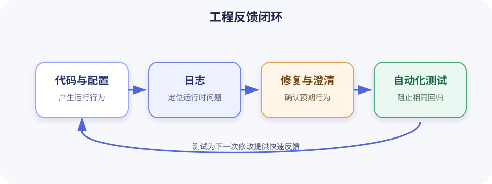

# 通用工程基础

本专题补齐 RAG 入门所需的日志与基础测试能力。日志保存程序运行时发生了什么，测试则把已经确认的行为变成可重复检查的规则。两者共同回答工程中最实际的两个问题：问题发生时怎样定位，代码修改后怎样确认没有破坏已有行为。

## 建议学习顺序

1. [日志基础](logging.md)：从事件、级别和上下文开始，学会输出能检索、能关联且不泄露敏感信息的日志。
2. [基础测试](basic-testing.md)：使用 pytest 验证正常路径、边界条件和失败路径，并学习 fixture、参数化和最小必要的替身。

两门课程的关系如下：



日志不能代替测试：看到一次正确输出，不能证明以后每次修改都正确。测试也不能代替日志：测试环境中通过的程序，仍可能因为生产数据、外部服务或配置而失败。

## 练习回答

课程中需要留档的观察结论和书面回答统一保存在[练习回答目录](answers/index.md)中。可运行代码、测试和演示文件仍保存在配套项目中，不在回答文档中重复。

## 配套项目

[工程基础示例项目](../../projects/engineering-foundations/README.md) 提供一个小型文档搜索模块、结构化日志配置、命令行演示和 pytest 测试：

```shell
cd projects/engineering-foundations
uv sync
uv run engineering-demo RAG --log-level INFO
uv run pytest
```

项目还包含一个不需要安装依赖的[日志级别交互实验](../../projects/engineering-foundations/logging-lab/index.html)。在浏览器中打开该文件，可以切换日志阈值，观察哪些事件会被保留。

## 推荐练习项目

为“本地文档搜索”增加工程保障：

本课程是否完成，只依据下面标记为“必须”的功能、自动化检查和知识验收。后面的“可选增强”不影响验收结果；代码审查时也不能把文档未列出的偏好临时追加为失败条件。如果以后确实需要扩大验收范围，应先修改本节并说明原因，再按新标准实现和验收。

### 功能验收（必须）

1. 执行 `uv run engineering-demo RAG --log-level INFO` 时，程序以成功状态结束，并返回标题或正文包含 `RAG` 的示例文档。
2. 搜索词忽略首尾空格和大小写；多个结果按照分数从高到低排列，分数相同时按照 `source` 排列；返回数量不超过 `limit`。
3. 没有匹配文档时返回空列表，不把“没有结果”误报成系统异常。
4. `limit` 小于 1 时抛出消息明确的 `ValueError`，并记录一条 `WARNING`：事件名为 `search_rejected`，包含同一次调用的 `request_id` 和原因 `invalid_limit`。
5. 空查询抛出消息明确的 `ValueError`，并记录一条 `WARNING`：事件名为 `search_rejected`，包含同一次调用的 `request_id` 和原因 `empty_query`。
6. 一次成功搜索至少产生 `search_started` 和 `search_completed` 两个 `INFO` 事件。两个事件使用相同的 `request_id`；开始事件包含文档数量和查询长度，完成事件包含结果数量和耗时。
7. 日志不记录原始查询、文档正文、密钥或个人信息。查询长度、数量、事件名、稳定 ID 和耗时可以记录。
8. 使用 `--json-logs` 时，每条日志都是可以解析的 JSON 对象，并至少保留 `timestamp`、`level`、`logger`、`message`、`event` 和 `request_id`。
9. 面向用户的搜索结果写入标准输出，诊断日志写入标准错误，两者可以被分别重定向。

本课程没有规定搜索算法必须采用特定函数拆分方式，也没有规定日志消息必须逐字相同。只要以上可观察行为和稳定字段满足要求，实现细节可以不同。

### 自动化验收（必须）

测试至少覆盖以下行为，每项都需要断言业务结果；涉及日志契约的项目还需要通过 `caplog` 断言级别和结构化字段：

- 正常命中以及首尾空格、大小写差异。
- 没有匹配结果。
- 结果数量上限和稳定排序。
- `limit` 为 0 或负数。
- 空查询。
- 成功事件共享同一个 `request_id`。
- JSON formatter 保留必需字段。
- 未知日志级别被明确拒绝。

从干净环境执行以下命令，所有命令都必须以退出码 0 完成：

```shell
cd projects/engineering-foundations
uv sync
uv run ruff format --check .
uv run ruff check .
uv run pytest
```

测试数量不是验收目标。以后可以合并、拆分或增加测试，只要上述行为仍被自动验证。

### 知识验收（必须）

- 能根据事件对系统的影响选择 `DEBUG`、`INFO`、`WARNING`、`ERROR` 或 `CRITICAL`，不把所有失败都记成 `ERROR`。
- 能解释 logger、handler、formatter 和 `LogRecord` 各自负责什么。
- 能说明 `request_id` 在哪里生成、如何传递，以及为什么不能把密钥、个人信息和完整文档写入日志。
- 能按 Arrange、Act、Assert 编写独立、确定且可读的测试。
- 能分别举例说明参数化、fixture、`tmp_path`、`raises` 和 `caplog` 适合解决什么问题。
- 能区分单元测试、集成测试和端到端测试，并说明当前内存搜索项目为什么主要使用单元测试。

### 可选增强（不影响验收）

- 打开并完成日志级别交互实验。
- 使用 `contextvars` 自动传递请求上下文。
- 增加日志文件轮转、集中采集、指标或 OpenTelemetry trace。
- 接入真实文件、数据库或远程搜索服务，并为外部边界增加 fake、mock 或集成测试。
- 增加覆盖率报告、持续集成工作流、性能测试或并发测试。
- 自定义终端颜色、日志消息文案或搜索结果展示格式。

这些增强项可以在后续课程或真实项目需要时加入。未实现其中任何一项，都不能作为本课程验收失败的理由。

完成本专题后，可以回到[人工智能学习路线](../roadmap.md)，继续第 1 阶段的 LLM 应用基础。
