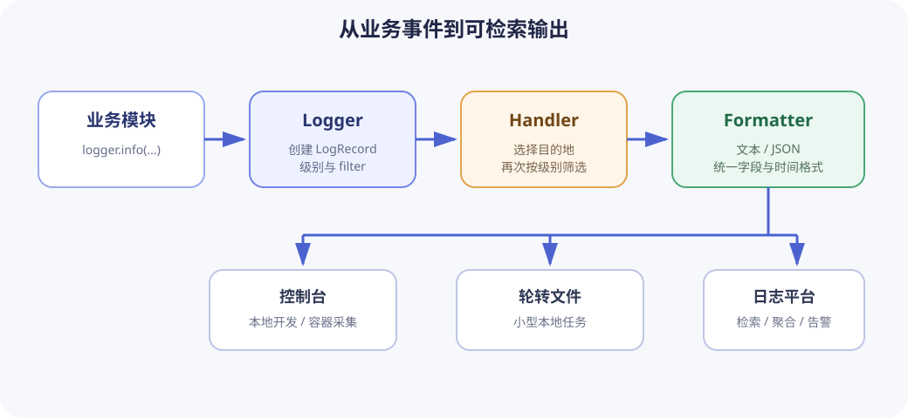

# 日志基础

日志是程序运行期间产生的事件记录。它的目标不是“多打印一些内容”，而是让开发者能够回答：哪次操作失败、失败发生在哪个模块、当时有哪些安全且必要的上下文，以及故障影响了一个请求还是整个服务。

本课程使用 Python 标准库 `logging` 演示通用概念。其他语言的日志库名称不同，但事件、级别、上下文、输出目的地和敏感信息控制等原则相同。

## 1. 日志与 `print()` 的边界

`print()` 适合命令行程序面向用户的正常输出，例如搜索结果或导出文件的位置。日志面向开发、运维和审计，用于记录程序内部事件。

```python
print("找到 3 篇文档")
logger.info("search completed", extra={"result_count": 3})
```

调用 `logger.info()` 时，Python `logging` 会先检查该级别是否需要处理；如果需要，才会创建一个 `LogRecord`。它是 `logging` 在内部用来表示本次日志事件的数据对象，其中保存了消息、日志级别、logger 名称、发生时间等信息。创建完成后，`logging` 的 handler 会接收这个对象，再使用 `logging` 的 formatter 将它转换为最终输出。

这里的 `extra` 是 `logging` 提供的关键字参数，用来给这个 `LogRecord` 附加结构化上下文。因此，字典中的 `result_count` 会成为本次记录的一个字段，但不会自动拼接到 `"search completed"` 这段消息中。formatter 负责把记录转换成最终输出：文本 formatter 可以用 `%(result_count)s` 读取该字段，JSON formatter 则可以把它保存为独立的 JSON 字段，方便后续筛选和统计。自定义字段名还应避开 `message`、`levelname` 等 `LogRecord` 已有属性，否则记录日志时会发生字段冲突。第 4 节会继续介绍 `LogRecord`、handler 和 formatter 之间的数据流。

两行内容看似相近，但用途不同：用户输出可以翻译、排版或通过管道交给其他命令；日志还需要级别、时间、模块名和请求标识，并可能被集中采集。不要用日志代替正常返回值，也不要只用 `print()` 报告后台故障。

异常与日志也不能互相替代。函数遇到无法完成的操作时，应通过返回值或异常把失败告诉调用者；日志只是记录这件事。只记一条 `ERROR` 后继续返回看似正常的空结果，会让调用者误判操作成功。

## 2. 把日志写成事件

一条有用日志通常包括：

| 字段           | 作用                               | 示例                        |
| -------------- | ---------------------------------- | --------------------------- |
| `timestamp`    | 事件何时发生                       | `2026-08-01T08:15:30Z`      |
| `level`        | 事件严重程度                       | `INFO`                      |
| `logger`       | 事件来自哪个模块                   | `engineering.search`        |
| `event`        | 稳定、可检索的事件名称             | `search_completed`          |
| `message`      | 给人阅读的简短说明                 | `search completed`          |
| `request_id`   | 把同一次操作的多条记录关联起来     | `req-7f31`                  |
| 业务上下文字段 | 解释事件但不暴露敏感信息的有限数据 | `result_count=3`            |
| 异常信息       | 错误类型和调用栈                   | `TimeoutError` 与 traceback |

“搜索失败”仍然太模糊。更可定位的事件应说明阶段和安全上下文：

```python
logger.error(
    "document parsing failed",
    extra={
        "event": "document_parse_failed",
        "request_id": request_id,
        "source_type": ".md",
    },
)
```

不要为了“上下文完整”记录查询全文、文档正文、Authorization 请求头、Cookie、API Key、身份证号或电子邮箱。日志往往保存时间长、访问面广，应默认把输入视为可能包含敏感信息。优先记录长度、数量、类别、稳定 ID 或经过批准的脱敏值。

## 3. 选择正确的日志级别

日志级别表达事件对系统的影响，而不是开发者当时的情绪。

| 级别       | 使用场景                             | 文档搜索示例                         |
| ---------- | ------------------------------------ | ------------------------------------ |
| `DEBUG`    | 仅排查问题时需要的细节               | 分词数量、候选文档得分               |
| `INFO`     | 正常业务里程碑                       | 搜索开始、搜索完成、索引加载成功     |
| `WARNING`  | 出现异常情况，但当前操作仍可受控处理 | 空查询被拒绝、单个损坏文档被跳过     |
| `ERROR`    | 当前功能或请求失败，但进程仍能继续   | 数据库超时导致本次搜索失败           |
| `CRITICAL` | 整个进程或核心能力可能无法继续       | 启动时关键配置损坏且没有安全降级方案 |

配置的级别是最低保留阈值。阈值为 `INFO` 时，会保留 `INFO`、`WARNING`、`ERROR` 和 `CRITICAL`，丢弃 `DEBUG`。可在[日志级别交互实验](../../projects/engineering-foundations/logging-lab/index.html)中切换阈值观察结果。

不要把用户输入校验失败一律记成 `ERROR`。如果系统正确拒绝了空查询，它是预期内的失败，通常使用 `WARNING` 或只返回明确的 4xx 错误。否则大量可预期事件会淹没真正的系统故障。

## 4. Python 日志的数据流

### logger、handler 与 formatter

这三个组件不是彼此独立的。logger 可以关联零个或多个 handler，每个 handler 可以设置一个 formatter；formatter 不直接关联到 logger。没有显式设置 formatter 时，handler 会使用 `logging` 提供的默认格式。一个常见配置的对象关系如下：

```text
logger
├── 控制台 handler
│   └── 文本 formatter
└── 文件 handler
    └── JSON formatter
```

代码中的 `logger.addHandler(handler)` 把 handler 添加到 logger；`handler.setFormatter(formatter)` 再把 formatter 设置到 handler。这样，同一个 logger 可以把同一条记录交给多个 handler，并让不同输出目的地使用不同格式。

应用调用 `logger.info()` 等方法时，logger 先根据日志级别判断是否需要处理；需要处理时才创建 `LogRecord`，并继续应用 logger 上的 filter。通过筛选的记录会被交给相关 handler：handler 决定是否接收记录以及把它发送到哪里，formatter 则负责把记录转换成最终的文本或 JSON。formatter 完成格式化后，handler 才把结果写入控制台、文件或其他目的地。

logger 和 handler 都可以设置最低日志级别，也都可以通过 `addFilter()` 添加 filter，但两者的筛选作用于不同层次。logger 控制某个日志来源产生的记录是否继续处理；每个 handler 则根据自己的输出目的地决定是否接收记录。例如，控制台 handler 可以接收 `INFO` 及以上级别的记录，而错误文件 handler 只接收 `ERROR` 及以上级别的记录。handler 默认使用 `NOTSET` 级别且没有 filter，此时不会在 logger 的筛选结果上再排除记录。



### root logger 与名称层级

各模块只取得以模块名命名的 logger：

```python
import logging

logger = logging.getLogger(__name__)
```

`logging` 自带一个位于名称层级顶端的 root logger；它不是应用在入口创建的。调用不带名称的 `logging.getLogger()` 可以取得它。程序入口通常只负责配置 root logger，例如设置级别、添加 handler，以及为 handler 设置 formatter。这里的“程序入口”是负责启动应用和组装全局配置的代码，例如命令行程序的 `main()` 或 Web 服务的启动模块。

`logging.basicConfig()` 是完成这类简单配置的便捷函数，适合在小型程序的入口调用一次。以第 5 节的配置为例，它会设置 root logger 的级别，创建默认写入标准错误流的 `StreamHandler`，根据 `format` 参数创建 formatter，将 formatter 设置到 handler，最后把 handler 添加到 root logger。root logger 已有 handler 时，后续调用默认不会重复配置，因此如果多个业务模块都调用 `basicConfig()`，最终采用哪套配置可能取决于哪个模块先执行。

logger 的层级只由 logger 名称中的点号决定，`logging` 不会读取文件夹结构来建立层级。例如，名为 `engineering.search` 的 logger 具有下面的名称层级：

```text
engineering.search → engineering → root logger
```

文件夹结构之所以经常看起来和 logger 层级相同，是因为模块通常使用 `logging.getLogger(__name__)`，而 `__name__` 来自 Python 的导入名称。如果 `engineering/search.py` 作为 `engineering.search` 导入，`__name__` 就是 `"engineering.search"`；但仅仅存在一个名为 `engineering` 的目录，并不会自动创建同名 logger。如果这个文件以其他名称导入，logger 名称也会随之改变；如果直接作为脚本运行，`__name__` 通常是 `"__main__"`。

logger 默认启用传播，也就是 `propagate=True`。名为 `engineering.search` 的 logger 创建记录后，会先交给自身关联的 handler（如果有），然后继续交给名为 `engineering` 的上级 logger 所关联的 handler（如果有），最终到达 root logger 的 handler。`engineering` 不需要对应一个真实目录；它只是这个 logger 名称中的上一级。如果代码没有配置名为 `engineering` 的 logger，记录会直接继续传到 root logger。

因此，业务模块通常不添加自己的 handler，而是让入口配置的 root handler 统一接收记录。如果子 logger 和 root logger 都有控制台 handler，并且传播仍然开启，同一条记录会在两处各输出一次。

## 5. 配置可读文本日志

小型命令行程序可以在入口处使用 `basicConfig()`。下面的代码可以直接保存为 Python 文件并运行：

```python
import logging

logger = logging.getLogger(__name__)


def configure_logging(level: str = "INFO") -> None:
    numeric_level = getattr(logging, level.upper(), None)
    if not isinstance(numeric_level, int):
        raise ValueError(f"invalid log level: {level}")

    logging.basicConfig(
        level=numeric_level,
        format="%(asctime)s %(levelname)s %(name)s %(message)s",
    )


def main() -> None:
    configure_logging()
    document_count = 3
    logger.info("loaded %d documents", document_count)


if __name__ == "__main__":
    main()
```

直接运行该文件时，模块 logger 的名称是 `__main__`。在没有额外配置的情况下，命名 logger（包括这里的 `__main__` logger）默认没有自己的 handler，所以不会直接把记录写入终端。`basicConfig()` 配置 root logger，并为它添加控制台 handler。由于命名 logger 默认设置了 `propagate=True`，`__main__` logger 会把记录向上传给 root logger，最终由 root logger 的 handler 输出。

因此，输出中的 logger 名称仍然是创建记录的 `__main__`，但实际执行输出的是 root logger 上的 handler。如果把 `logger.propagate` 设为 `False`，同时又不给模块 logger 添加 handler，这条 `INFO` 记录就不会输出。正常运行时的输出类似：

```text
2026-08-02 14:30:00,000 INFO __main__ loaded 3 documents
```

示例把可变数据作为日志参数传入。不建议写成 `logger.info(f"loaded {document_count} documents")`。参数形式把消息模板与数据分开，而且日志级别被过滤时可以避免提前格式化。性能差异通常不是首要问题，稳定的事件模板和统一风格更重要。

## 6. 结构化日志与请求上下文

供人直接阅读的文本适合本地开发；生产服务常使用一行一个 JSON 对象，便于按字段筛选、聚合和告警：

```json
{
  "timestamp": "2026-08-01T08:15:30Z",
  "level": "INFO",
  "logger": "engineering.search",
  "event": "search_completed",
  "request_id": "req-7f31",
  "result_count": 3,
  "duration_ms": 23,
  "message": "search completed"
}
```

结构化日志不是把整段文本塞进 `message` 后就结束。需要检索的值应有稳定字段名，字段类型也应保持一致。例如，上例用字段名 `duration_ms` 标明单位，并把值保存为数字 `23`；不要又在其他记录中把它写成字符串 `"23ms"`。

一次 HTTP 请求、后台任务或命令执行应在入口生成 `request_id`，随后传递给关键日志。这里包含两个步骤：先把 `request_id` 作为普通业务函数的参数传给需要它的函数；记录日志时，再通过 `extra` 把它添加到 `LogRecord`。例如：

```python
def search_documents(documents: list[str], request_id: str) -> list[str]:
    results = documents[:3]
    logger.info(
        "search completed",
        extra={
            "event": "search_completed",
            "request_id": request_id,
            "result_count": len(results),
        },
    )
    return results
```

在这个例子中，函数定义里的 `request_id: str` 展示了通过普通函数参数传递上下文，`extra` 中的 `"request_id": request_id` 则把这份上下文附加到当前日志记录。这种写法需要在函数定义和每次调用中都写出 `request_id`，但它能清楚展示数据从哪里来、经过哪些函数。

大型异步服务可以进一步自动补充上下文，但 `LoggerAdapter`、`logging.Filter` 和 `contextvars` 的作用不同。`LoggerAdapter` 在调用 logger 时附加预先绑定的字段；`contextvars` 保存当前异步任务的上下文，并让这些值随任务的执行流程传递；自定义 `logging.Filter` 则可以在 handler 输出前读取当前上下文，并把 `request_id` 等字段写入收到的 `LogRecord`。

因此，`logging.Filter` 本身不负责让 `request_id` 跨函数或异步任务传递，它只是把已经可以读取的上下文补充到日志记录中。采用这些机制之前，必须先明确 ID 在何处生成、跨哪些边界传播、何时清除，否则上下文可能串到另一个请求。

## 7. 正确记录异常

在 `except` 块中使用 `logger.exception()`，会自动附带当前异常的调用栈：

```python
try:
    index.refresh()
except TimeoutError:
    logger.exception(
        "index refresh timed out",
        extra={"event": "index_refresh_failed"},
    )
    raise
```

如果上层会统一记录并处理异常，下层不必先记录后重新抛出，否则同一个故障可能出现多条重复 `ERROR`。选择最了解业务上下文且真正决定“重试、降级还是终止”的边界记录一次。

不要使用 `logger.error("failed: %s", error)` 代替调用栈；字符串通常只有异常消息，缺少出错文件和调用路径。也不要无条件捕获 `Exception` 后继续运行，除非边界确实有明确的隔离或降级策略。

## 8. 文件日志、轮转与集中采集

本地脚本可以使用 `FileHandler` 或 `RotatingFileHandler`。长期运行的容器服务通常更适合把日志写到标准输出或标准错误，由运行平台负责采集、保留和轮转。应用自行写无限增长的文件，会带来磁盘耗尽、并发写入和容器实例销毁后日志丢失等问题。

无论输出到哪里，都应明确：

- 日志保存多久，谁可以读取。
- 时区是否统一，跨系统关联时通常使用 UTC。
- 单行大小和总量限制，是否需要采样高频 `DEBUG` 事件。
- 多进程或多实例如何集中采集。
- 敏感字段如何拦截、脱敏和审计。

### 日志、指标与 trace

Python 标准库提供了用于日志的 `logging`，但没有与之对应的通用指标或 trace 模块。实际项目通常使用 Prometheus Python client 或 OpenTelemetry 等第三方库：

| 信号  | Python 中的常见接口                                                                          | 代码产生的数据                                                       | 采集与展示方式                                        |
| ----- | -------------------------------------------------------------------------------------------- | -------------------------------------------------------------------- | ----------------------------------------------------- |
| 日志  | `logging.Logger`、`logging.LogRecord`                                                        | 一条条带时间、级别、消息和上下文的事件记录                           | handler 写到控制台或文件，也可以转发到日志平台        |
| 指标  | `prometheus_client.Counter`、`prometheus_client.Histogram`，或 `opentelemetry.metrics.Meter` | `Counter` 累计次数，`Histogram` 记录延迟等数值的分布                 | Prometheus 抓取指标，或由 OpenTelemetry exporter 发送 |
| trace | `opentelemetry.trace.Tracer` 和 `opentelemetry.trace.Span`                                   | 带 `trace_id`、父子关系、耗时和属性的 span；多个 span 组成一条 trace | exporter 发送到追踪后端，展示为时间线或跨组件的调用树 |

指标通常不是一行描述某次请求的文本。例如，请求 `Counter` 可以按结果类别分别累计成功和失败次数，监控系统据此计算一段时间内的错误率；`Histogram` 持续记录请求耗时，监控系统据此展示延迟分布和趋势。

trace 则关注某一次具体请求。入口组件创建根 span，后续的 HTTP 调用、数据库查询等操作创建子 span；这些 span 共享同一个 `trace_id`，并通过父子关系还原调用顺序和各阶段耗时。OpenTelemetry API 负责在代码中创建指标或 span，还需要配置 SDK 和 exporter，数据才会被发送到外部监控或追踪系统。

日志、指标和 trace 是互补信号：日志解释离散事件，指标回答错误率和延迟趋势，trace 展示一次请求跨组件的调用链。不要把每个数值都做成日志，也不要期待仅凭指标还原具体失败上下文。

## 9. 常见反模式

- `except Exception: pass`：失败被吞掉，调用者和日志都得不到信号。
- 所有地方都调用根 logger：无法根据模块定位或配置。
- 每个模块都添加 handler：同一记录沿层级传播后重复输出。
- 在循环中记录大量 `INFO`：正常流量制造高成本噪声。
- 只写 `something went wrong`：没有事件阶段、ID 或异常调用栈。
- 记录完整对象：对象可能包含密钥、正文或不稳定表示。
- 通过日志判断业务成功：调用者仍应依赖返回值或异常。
- 在测试中写死精确时间戳或整行日志文本：时间戳每次运行都会变化，调整 formatter 的字段顺序也会导致测试失败。应改为断言日志级别、消息、事件名和 `request_id` 等稳定字段。

## 10. 练习与验收

在[配套项目](../../projects/engineering-foundations/README.md)基础上完成：

1. 运行文本格式和 JSON 格式的命令行演示，找出相同事件在两种格式中的对应字段。
2. 在交互实验中分别选择 `DEBUG`、`INFO` 和 `ERROR`，解释每次被过滤的事件。
3. 为“没有搜索结果”增加一条合理级别的日志，但不记录原始查询文本。
4. 模拟一次外部检索超时，只在决定终止本次请求的边界使用 `logger.exception()`。
5. 使用 pytest `caplog` 断言空查询产生 `WARNING`、事件名和同一个 `request_id`。

完成标准：给定一条失败日志，可以通过事件名、模块、级别和请求 ID 定位到代码阶段；调整级别不需要修改业务模块；日志中不包含密钥、完整查询或文档正文。

完成后继续学习[基础测试](basic-testing.md)。

## 延伸阅读

- [Python Logging HOWTO](https://docs.python.org/3/howto/logging.html)
- [Python Logging Cookbook](https://docs.python.org/3/howto/logging-cookbook.html)
- [Python LogRecord 属性](https://docs.python.org/3/library/logging.html#logrecord-attributes)
- [Prometheus Python client 指标类型](https://prometheus.github.io/client_python/instrumenting/)
- [OpenTelemetry Python 手动埋点](https://opentelemetry.io/docs/languages/python/instrumentation/)
