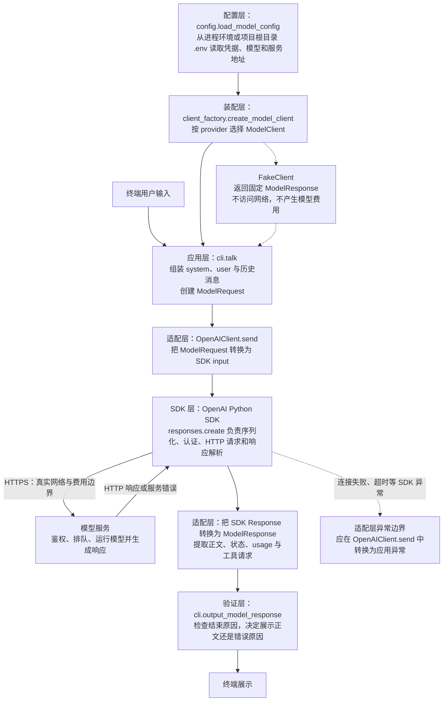

# 模型调用与消息练习回答

本文记录[模型调用与消息](../model-calls-and-messages.md)课程任务 1 的调用链。任务 2、任务 3 的可运行实现和验证方式保存在 [LLM Terminal Assistant 项目](../../../projects/llm-terminal-assistant/README.md)中，不在回答文档中重复代码。

## 任务 1：一次模型调用

### 选定的 SDK

真实模型适配器使用 OpenAI Python SDK 的 Responses API。应用代码依赖项目自己的 `ModelClient`、`ModelRequest` 和 `ModelResponse`，由 `OpenAIClient` 负责在项目数据结构与 SDK 对象之间转换。

### 调用链

### 关键责任位置

| 关注点       | 位置                          | 责任                                                                                        |
| ------------ | ----------------------------- | ------------------------------------------------------------------------------------------- |
| 凭据读取     | `config.load_model_config()`  | 从环境变量读取 `API_KEY`，不把凭据写入消息、日志或源码                                      |
| 消息组装     | `cli.talk()`                  | 按对话顺序创建项目自己的 `Message` 列表和 `ModelRequest`                                    |
| SDK 请求转换 | `OpenAIClient.send()`         | 将项目消息转换为 SDK `input`，调用 `responses.create()`                                     |
| 网络错误转换 | `OpenAIClient.send()`         | 捕获连接失败、超时等 SDK 异常并转换为项目自己的异常；当前实现已确定边界，但尚未补上捕获逻辑 |
| SDK 响应转换 | `OpenAIClient.send()`         | 将 SDK 响应转换为项目自己的 `ModelResponse`，不向业务层暴露 SDK 原始对象                    |
| 输出验证     | `cli.output_model_response()` | 检查结束原因；正常完成时展示正文，否则展示错误原因                                          |

### 网络与费用边界

调用 `OpenAIClient.send()` 本身不等同于模型运行。真正跨出本地进程的边界，是 OpenAI Python SDK 执行 `responses.create()` 并向配置的远程服务地址发送 HTTPS 请求。远程服务收到请求后才会进行鉴权、排队和模型推理，并可能按服务商规则产生费用和占用速率限额。

使用 `FakeClient` 时，响应由本地代码直接生成，不经过 SDK、网络或模型服务，因此不会产生真实模型调用费用。HTTP 请求成功只说明服务返回了响应，应用仍需依据结束原因和业务规则验证结果，不能把 SDK 或 HTTP 200 当作业务成功保证。

## 知识检查

### 模型为什么没有自动跨请求记忆？

调用链中的每次模型调用都是一份独立请求：应用组装本轮 `ModelRequest`，SDK 只把这次请求包含的消息序列化并发送给模型服务，模型服务据此生成一次响应。上一轮请求结束后，模型不会自动从当前应用取回旧消息；如果下一轮请求没有再次携带历史，模型服务就看不到上一轮的用户问题和模型回答。

因此，对话历史属于应用责任。应用需要保存必要的 `user` 和 `assistant` 消息，在下一轮组装请求时按原顺序回放，并决定何时删除、裁剪或摘要。SDK 负责发送应用交给它的数据，但不会替应用决定哪些历史应当保留，也不能把服务商可能提供的会话状态误解为模型自身拥有永久记忆。

### HTTP 200 为什么不等于业务成功？

HTTP 200 只说明调用链中的网络请求成功到达服务，并且服务返回了一个可以按协议解析的响应。它不保证模型输出已经满足应用目标。响应仍可能因为输出上限而截断、包含拒绝、只提出工具请求、缺少正文，或者生成事实错误、格式不合法和违反业务规则的内容。

SDK 解析 HTTP 响应后，适配层仍要把正文、结束原因、usage 和工具请求转换为项目自己的 `ModelResponse`；随后应用验证层根据结束原因和业务约束决定接受、继续处理还是报告失败。网络层成功、SDK 解析成功和业务验证成功是调用链中三个不同判断，不能互相替代。

### tool 消息为什么仍可能包含不可信指令？

`tool` 角色只说明这段内容是应用把某次工具执行结果反馈给模型时使用的协议类型，并不能证明内容安全可信。工具可能读取用户文件、网页、数据库或第三方接口，这些外部数据可能包含错误信息、恶意文本，甚至包含“忽略之前规则”之类的 Prompt Injection。工具执行器是已知的，不代表它读取和返回的数据天然可信。

在调用链中，应用负责选择允许使用的工具、校验工具参数、执行权限检查，并把工具结果作为不可信数据传回模型。模型基于工具结果生成的新内容仍要经过应用验证；涉及文件、数据库、网络或其他副作用的操作，也必须由应用代码再次检查权限和风险。SDK 只负责传输带有工具调用 ID 的协议数据，不会替应用判断工具内容是否可信或授予操作权限。
