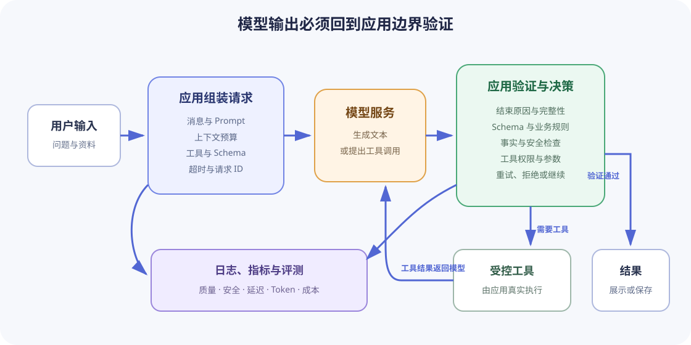

# LLM 使用基础

本专题面向第一次把大语言模型接入程序的学习者。目标不是记住某一家服务商的 SDK，而是建立一套可以迁移的工作模型：应用组织请求，模型生成候选输出，应用验证输出并决定是否执行外部操作，最后用测试、日志和指标判断系统是否可靠。

完成本专题后，学习者应能独立实现一个小型终端助手，并说明它在上下文、结构化输出、工具权限、失败恢复、安全和成本方面的边界。

## 学习前提

- 能运行 Python 或其他语言的命令行程序，并使用项目自己的依赖环境。
- 理解 HTTP、JSON、环境变量、异常和日志的基本概念。
- 能编写基础自动化测试，且知道测试不应访问真实付费接口。

如果这些内容还不熟悉，先完成 [Python 工程基础](../python/index.md)和[通用工程基础](../engineering/index.md)。

## 建议学习顺序

1. [模型调用与消息](model-calls-and-messages.md)：建立应用、SDK、模型服务和模型输出之间的边界。
2. [Token 与上下文窗口](tokens-and-context.md)：理解输入、历史、检索材料和输出如何共同占用预算。
3. [生成参数与采样](generation-parameters.md)：理解 temperature、top-p 和输出上限能控制什么。
4. [Prompt 设计](prompt-design.md)：把任务、输入、约束和示例组织成可测试的指令。
5. [结构化输出](structured-output.md)：用 Schema 约束形状，并在应用侧验证语义。
6. [工具调用](tool-calling.md)：让模型提出工具请求，由应用检查并执行。
7. [流式输出与可靠性](streaming-and-reliability.md)：处理流、超时、重试、限流、并发和幂等性。
8. [安全、评测与可观测性](safety-evaluation-observability.md)：处理 Prompt Injection、敏感信息、质量回归、延迟和成本。

各课之间的数据流如下：

## 配套交互实验

[LLM 使用基础交互实验](../../projects/llm-usage-lab/index.html)不访问网络，也不调用真实模型。它用可调参数演示两件容易混淆的事：

- 上下文窗口是输入与输出共享的总预算，不能只计算用户问题。
- temperature 与 top-p 改变候选 Token 的分布和候选集合，但不会为模型补充事实。

实验中的 Token 数和候选概率是教学数据，不是对任何真实模型或 tokenizer 的复刻。真实项目必须使用所选模型对应的计数接口或 tokenizer，并以服务端返回的 usage 为最终记录。

## 综合项目：可靠的终端助手

选择一种支持消息、结构化输出、流式响应和工具调用的模型 SDK，实现一个终端助手。SDK 与模型名称可以替换，但必须把服务商相关代码限制在单独的适配层，业务代码不能直接依赖原始响应对象。

建议场景是“本地学习资料助手”：它可以总结用户提供的文本，按约定结构生成学习卡片，并通过只读工具查询一个内存资料目录。课程不要求实现 RAG、向量检索、Web UI 或数据库。

### 功能验收（必须）

1. 从环境变量读取 API 凭据；缺失时给出明确错误，仓库中没有真实凭据或包含凭据的日志。
2. 至少支持 system、user 和 assistant 三类消息；连续两轮对话时，第二轮请求包含第一轮必要历史。
3. 在发送前计算或估算上下文预算；超过项目设定的安全阈值时拒绝请求或采用有记录的裁剪策略，不能静默丢弃任意消息。
4. 普通文本模式支持流式显示；流式过程中断时明确标记回答不完整，不把部分文本当作完整成功结果。
5. 学习卡片模式返回经 Schema 验证的对象，至少包含 `title`、`summary` 和 `questions`。格式或业务约束不合法时进入明确的失败或有限修复流程。
6. 至少注册一个只读工具。模型只能提出工具名与参数，应用负责校验参数、执行工具并把结果作为工具消息返回；未知工具和非法参数必须被拒绝。
7. 对超时、429 和可重试的 5xx 使用有限次数的退避重试；对认证失败、无效请求和 Schema 失败不盲目重试。
8. 每次逻辑请求记录稳定的 `request_id`、模型标识、成功或失败类别、总耗时、首 Token 延迟、输入 Token、输出 Token 和重试次数，不记录完整 Prompt、模型原文、密钥或工具返回的敏感正文。
9. 支持取消正在进行的流式请求；取消后停止消费响应，不继续执行后续工具。
10. 对来自用户、文件或工具的文本都按不可信数据处理；资料中的“忽略之前指令”不能改变系统规则或获得额外工具权限。

### 自动化验收（必须）

使用 fake 或 stub 模型客户端完成测试，默认测试套件不得访问网络、不得需要 API Key、不得产生费用。至少覆盖：

- 消息顺序和必要历史被正确传给适配层。
- 上下文超预算时采用文档声明的拒绝或裁剪行为。
- 合法结构化结果被接收，缺字段、错误类型和业务约束失败被拒绝。
- 合法工具调用会执行一次；未知工具、额外参数和越权路径不会执行。
- 流式分片按顺序组合；中途异常不会被标记为完整成功。
- 429 与一次超时会按策略重试，认证错误不会重试，重试次数不会超过上限。
- 同一个幂等键重放时，不会重复执行模拟的有副作用操作。
- 日志包含稳定观测字段，且不包含测试 Prompt、虚构密钥或工具敏感结果。

测试应断言可观察行为，不应绑定服务商 SDK 的私有类名或整段原始响应。真实接口只作为手动验收，可通过显式标记与默认测试分开。

### 知识验收（必须）

学习者需要以书面或口头形式准确回答：

- 为什么模型输出是候选内容，而不是已经验证的事实或授权指令？
- system、user、assistant 和 tool 消息分别由谁产生，信任级别有何不同？
- 为什么长上下文、低 temperature 和合法 JSON 都不能单独保证答案正确？
- Schema 验证、业务规则验证和工具权限检查分别拦截什么问题？
- 哪些失败可以重试，为什么幂等性会影响重试安全？
- 如何同时评测质量、延迟、成本和安全，而不是只看一次主观回答？

### 最终检查（必须）

项目 README 必须写明安装、环境变量、运行、测试和手动验收命令。验收时依次完成：

1. 在不配置 API Key 的环境中运行默认测试，全部通过且没有网络请求。
2. 运行项目定义的格式化检查、Lint 和测试命令，全部以退出码 0 结束。
3. 配置个人测试凭据后完成一次文本流式请求、一次结构化请求和一次只读工具调用。
4. 检查三次请求的日志：必需观测字段存在，Prompt、密钥和敏感正文不存在。
5. 使用包含 Prompt Injection 的资料完成一次手动测试，确认系统不改变规则、不执行越权工具。

只有功能、自动化、知识和最终检查四部分同时通过，才视为完成本专题。某次回答“看起来不错”、调用真实接口成功一次或实现了额外 UI，都不能替代上述验收。

### 可选增强（不影响验收）

- 增加多模型路由、缓存、批处理或并发上限。
- 为写操作加入用户确认和审计记录。
- 增加多模态输入、会话持久化或 RAG。
- 建立线上反馈、A/B 测试或更完整的追踪系统。

这些增强不能被临时追加为课程必需条件。

## 完成后去向

完成本专题后，回到[人工智能学习路线](../roadmap.md)，继续学习 Embedding、信息检索和 RAG。工具调用在本专题只覆盖安全执行循环；复杂工作流、MCP、Agent 记忆和人工审批属于后续 Agent 课程。
