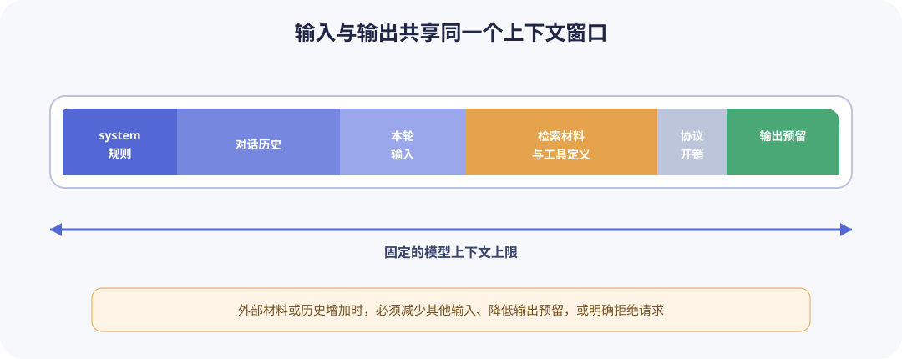

# Token 与上下文窗口

模型处理的基本单位是 Token，而不是字符、汉字或单词。tokenizer 按自己的词表与规则把文本转换成 Token ID；不同模型的 tokenizer 不一定相同，同一段文本的 Token 数也会变化。

## 1. Token 不是固定长度单位

一个汉字可能对应一个或多个 Token，英文单词也可能被拆成词根、空格和标点。代码、JSON、罕见字符和混合语言的 Token 数与字符数之比通常与普通中文段落不同。因此，“一个字符对应几个 Token”只能用于粗略估算，不能作为硬性校验。

需要在客户端预判时，应使用目标模型提供方针对该模型及具体版本发布或明确兼容的 tokenizer、消息编码实现或 Token 计数接口；所用 SDK 只是加载计数工具或调用模型服务的载体，不决定模型的分词规则。统计完整聊天输入时，还需要应用该模型及服务接口对应的消息编码方式；请求完成后，以服务端返回的输入和输出 usage 为记账依据。模型、tokenizer 或消息编码版本变化时要重新验证估算误差。

API 的传输格式和模型的输入编码属于不同层次。以使用 OpenAI Python SDK 调用 OpenAI Responses API 或兼容服务为例，应用先用自己维护的数据结构组织消息，SDK 再把最终请求载荷中的 `role`、`content` 等字段序列化为 HTTP/JSON 请求并发送。模型通常不会直接读取这份 JSON：服务端先解析请求，再由模型服务的请求处理或预处理层，而不是模型本身，按照目标模型的消息编码规则处理角色、消息边界、工具等结构，并把文本转换成 Token ID 或模型接受的等价内部表示。具体内部格式由提供方实现，可以是聊天模板或专用结构化编码。

```text
应用维护的消息与请求表示
→ SDK 序列化为 HTTP/JSON 请求
→ 服务端解析并规范化请求结构
→ 按目标模型的消息编码规则处理并分词
→ 模型输入
```

因此，OpenAI API 兼容的 JSON 结构只规定客户端怎样表达请求，不规定目标模型的词表；使用 OpenAI SDK 连接兼容服务，也不等于改用 OpenAI 模型的 tokenizer。真正决定计数规则的是目标服务最终运行的模型及其服务端预处理。

请求前统计完整消息时，不需要为了计数再创造另一套业务消息格式。应用应从自己维护的消息与请求表示生成唯一一份最终提供方请求载荷，再让计数器与负责实际发起模型生成请求的客户端（以下简称“模型生成客户端”）复用它：

```text
应用自己维护的消息与请求表示
→ 唯一的提供方请求载荷（消息、工具、文件等）
→ 请求级 Token 计数器
→ 预算检查
→ 同一载荷交给模型生成客户端
```

如果目标服务提供请求级计数接口，应优先把同一载荷交给该接口。例如，OpenAI Responses API 的[输入 Token 计数接口](https://developers.openai.com/api/docs/guides/token-counting)接收与生成接口相同的输入、消息、图片、文件和工具格式，并把角色、消息边界等结构开销计入结果。这里是服务端计数，OpenAI SDK 只负责调用接口。OpenAI 兼容服务不一定实现该接口，必须按该服务的文档或实际集成测试确认；没有请求级计数接口时，才使用目标模型明确兼容的本地 tokenizer 和消息模板进行估算。例如，Hugging Face tokenizer 的聊天模板负责把 `role`、`content` 等消息字段渲染成目标模型实际分词的提示词结构，这不是把消息改成应用自创的格式。

## 2. 多轮请求共享活跃上下文

上下文窗口上限约束单次实际模型调用中，本轮活跃输入上下文与本轮生成输出可共同占用的 Token 总量。该上限按单次调用计算，不是从任务开始以来所有 Token 的累计配额。模型或 API 还可能另设最大输入上限或最大输出上限，实际调用需要同时满足这些限制。在多轮对话或 Agent 系统中，后续请求通常不会从空白上下文开始：历史内容可能由客户端再次发送，也可能由服务端维护。同一任务中的后续请求会继承此前保留或压缩的内容，并与本轮新增内容共同构成当前活跃输入上下文。

以某一轮模型调用为例，可以近似按以下关系计算预算：

```text
本轮活跃输入上下文
= 保留或压缩后的此前上下文
+ 本轮新增的用户输入、检索材料、工具定义与工具结果
+ 模型实际接收的消息封装等输入开销

本轮活跃输入上下文 + 本轮输出 Token 预算
≤ 该模型的上下文窗口上限
```



这里的“本轮输出”不是当前请求的输入内容，而是模型响应该请求时为生成内容预留的空间。如果本轮输出被保留，它会在下一轮成为活跃输入上下文的一部分。随着交互继续，活跃上下文通常会增长；接近系统设定的压缩阈值或模型窗口上限时，系统需要裁剪、摘要或压缩较早内容。压缩不会扩大模型的上下文窗口，只是用更少的 Token 携带此前的关键信息；没有保留下来的原始细节不再处于活跃上下文中。

以 Codex 为例，其配置参考将 [`model_context_window`](https://learn.chatgpt.com/docs/config-file/config-reference) 定义为当前模型可用的上下文窗口，并提供触发历史自动压缩的 Token 阈值。OpenAI 的[上下文压缩说明](https://developers.openai.com/api/docs/guides/compaction)进一步说明，压缩后的内容会代替完整对话记录传入后续响应。因此，Codex 任务中的多轮请求会延续上下文，但每一次实际模型调用仍受当前模型的上下文窗口上限约束。

不同服务商和 API 对输出上限使用的参数名与计数规则可能不同。以 OpenAI Responses API 的 [`max_output_tokens`](https://platform.openai.com/docs/api-reference/responses/create) 参数为例，它规定一次响应可使用的输出 Token 上限；对于使用推理 Token 的模型，该上限同时包括可见输出 Token 和推理 Token。它不会扩大模型的上下文窗口，也不能突破模型自身的最大输出上限。

模型硬限制、应用预算和运行时统计来自不同所有者，不能都等待生成响应返回后再决定。例如，OpenAI 的[模型目录](https://developers.openai.com/api/docs/models)分别公布其模型的上下文窗口与最大输出，而不是在每次 Responses API 响应中把这些限制作为 usage 返回。建议按下表确定来源、配置位置和传输方式：

| 项目              | 来源与本地配置位置                                                                                  | 是否随生成请求发送                             | 模型服务端的处理                                               |
| ----------------- | --------------------------------------------------------------------------------------------------- | ---------------------------------------------- | -------------------------------------------------------------- |
| 上下文窗口上限    | 从目标模型提供方的模型文档或元数据取得；作为模型硬能力保存在应用维护的模型能力配置中                | 通常不发送，模型标识已经选择了服务端配置       | 按服务端真实窗口独立计数并校验；本地配置不能扩大真实窗口       |
| 模型最大输入上限  | 仅在提供方另行声明时记录到模型能力配置中；没有已知的独立限制时应显式表示“未设置”                    | 通常不发送                                     | 在共享上下文窗口之外，再校验独立输入限制（如有）               |
| 模型最大输出上限  | 从目标模型提供方文档或元数据取得；作为模型硬能力保存在应用维护的模型能力配置中                      | 通常不发送                                     | 无论请求值多大，都不会允许生成突破模型硬上限                   |
| 本轮输出预算      | 由应用根据任务契约决定；放在本次生成请求或单次调用配置中                                            | 如果接口支持请求级输出上限，就映射到该接口参数 | 把它作为本次生成的停止上限；到达上限时可能返回截断或未完成状态 |
| 显式安全余量      | 由应用根据本地估算与服务端实际 usage 的差异，以及可能存在的额外输入开销进行校准；放在预算策略配置中 | 不发送                                         | 服务端不知道这项应用策略，仍按实际 Token 计数处理请求          |
| 估算输入 Token 数 | 由请求级计数接口或本地计数器针对最终载荷动态取得；放在预算结果中                                    | 不把估算值作为生成参数发送                     | 服务端会独立计算实际输入 Token，不信任客户端估算值             |
| 实际 usage        | 由服务端在请求执行后产生；保存在响应记录、日志或计费数据中                                          | 它是响应数据，不是请求配置                     | 返回本次实际输入、输出及提供方支持的明细，供结算和校准使用     |

应用在请求前根据本地计数结果和应用侧有效窗口执行预算检查；模型服务端则按照自身的消息编码和目标模型的真实窗口独立计算并进行最终校验。本地配置可以把应用侧有效窗口设得比服务端真实窗口更小，以便更早触发压缩、缩短输入或拒绝请求，但不能扩大服务端允许的真实窗口。两者的关系应满足：

```text
应用侧有效窗口 ≤ 服务端真实上下文窗口
```

例如，服务端真实窗口为 1M Token、应用侧有效窗口为 200K Token 时，应用会按 200K Token 提前控制预算；反之，服务端真实窗口只有 200K Token，即使本地配置为 1M Token，超出服务端硬限制的请求仍会被拒绝。因此，本地配置能够采用比服务端更保守的限制，不能赋予模型原本不具备的上下文容量。

之所以要把“本轮输出预算”映射到提供方的请求级输出参数，是为了让预算检查所预留的空间与服务端实际允许生成的空间保持同一份契约。假设预算器只预留 2,000 Token，但请求没有设置相应上限，服务端采用更大的默认值，就可能产生比应用计划更多的输出、成本或延迟；反过来，服务端默认值更小时，应用以为预留的输出空间也不一定可用。如果目标接口不支持请求级输出上限，应用就无法精确执行这项预算，应按提供方声明的默认行为和模型硬上限采取保守值，并在适配层明确记录这种差异，不能假装已经把本地预算传给服务端。

如果 API 支持并设置了请求级输出上限，实际可用的输出预算会同时受到请求设置、模型最大输出上限和上下文剩余空间的约束，可以近似表示为：

```text
实际可用输出预算
≤ min(请求设置的输出上限, 模型最大输出上限, 上下文窗口上限 - 本轮活跃输入 Token 数)
```

估算的本轮活跃输入 Token 数与输出 Token 预算之和超过上下文窗口上限时，必须压缩或缩短输入、降低输出上限，或者拒绝本轮调用。当两者之和接近上下文窗口上限时，不应把剩余空间全部分配给输出，而应预留一定的安全余量，以容纳客户端估算误差以及尚未计入的消息结构等输入开销。安全余量没有适用于所有模型和 API 的固定值，应根据目标服务的实际 Token 计数结果进行校准。

## 3. 长上下文的取舍

更长窗口能容纳更多材料，但不保证答案更好：

- 无关内容会稀释关键证据。
- 冲突、过期和重复材料会增加判断难度。
- 请求成本和首 Token 延迟通常随输入增大。
- 关键信息的位置可能影响模型使用效果。
- 更长的外部文本扩大 Prompt Injection 攻击面。

因此应优先选择相关、可引用、来源清楚的内容，而不是“能塞多少就塞多少”。RAG 课程会进一步讨论检索与切块。

## 4. 请求超出上下文窗口时的处理策略

当估算的本轮活跃输入 Token 数与输出 Token 预算之和超过上下文窗口上限时，可选策略包括：

- 拒绝请求并告诉用户如何缩短输入。
- 保留系统或开发者指令和最近消息，按已声明规则裁剪更早历史。
- 对旧历史生成摘要，同时保留摘要版本和原始消息引用。
- 减少检索片段数量或单片段长度。
- 降低输出上限，但不能低到必然截断约定结构。

不能随意从中间删除消息，也不能只截断工具结果的一半。工具请求和对应结果通常要成对保留，否则后续消息会失去语义。

## 5. 成本估算

若服务按输入和输出分别计价，一次请求的估算成本可以写成：

```text
输入成本 = 输入 Token / 计价单位 × 输入单价
输出成本 = 输出 Token / 计价单位 × 输出单价
总成本 = 输入成本 + 输出成本
```

价格会变化，应放在配置或成本表中并记录生效日期，不把示例价格写死在业务逻辑里。缓存输入、批处理或不同服务等级可能有不同价格，也要分开记录。

## 6. 交互实验

打开[上下文与采样实验](../../projects/llm-usage-lab/index.html)，选择“上下文预算”。调整系统或开发者指令、历史、本轮用户输入、外部材料和本轮输出预算，观察它们的总量何时超过上下文窗口上限。

这个实验只演示 Token 预算的加总关系，不演示删除不同消息所造成的语义后果。验收目标是能够判断一次调用是否超出上下文窗口，并指出可通过缩短或压缩输入、降低输出预算，或者拒绝本轮调用进行处理。消息裁剪策略由任务 3 单独练习。

## 7. 练习与验收

本课继续扩展 [LLM Terminal Assistant](../../projects/llm-terminal-assistant/README.md)。任务 1 的固定样本、计数入口和复现命令保存在项目中，计数结果、观察结论和知识检查属于书面记录；任务 2、任务 3 的实现、自动化测试和项目行为说明保存在该项目中，不另建重复项目。本课须为项目增加默认离线的自动化测试入口，并在项目 README 中记录测试命令；可使用 Python 标准库 `unittest`，也可使用项目明确声明的开发依赖。

### 任务 1：比较目标模型的 Token 计数（必须）

选择终端项目准备使用的一个目标模型，准备内容固定且不含敏感信息的中文、英文、JSON 和代码样本。使用目标模型提供方针对该模型及具体版本发布或明确兼容的 tokenizer、消息编码实现或 Token 计数接口统计每份样本；SDK 仅作为加载计数工具或调用模型服务的载体，不决定模型的分词规则。在项目中提供可重复执行的计数入口。书面记录须包含原始样本或其项目内位置、字符数及其计算方法、Token 数、模型标识、tokenizer、消息编码实现或计数接口的名称与版本，以及实际执行命令。

如果计数方式必须访问远程服务，则把它标记为手动集成步骤；默认自动化测试不得访问网络、要求 API Key 或产生费用。服务端 usage 若包含消息封装等开销，不得直接当作样本文本本身的 Token 数。

通过条件：四类固定样本都有可复现的计数结果；记录足以让其他人在相同模型和计数工具版本下重新执行；结论没有宣称固定的“字符换 Token”比例；远程计数不会在默认测试中运行。

### 任务 2：实现预算器（必须）

在应用实际发起模型生成调用之前执行预算检查；检查未通过时，不得调用模型生成客户端或其适配层。独立的本地计数器或远程请求级计数接口属于预算检查的输入路径，不是生成调用。预算器接收最终准备发送的消息。限制项至少包含上下文窗口上限、本轮输出预算、显式安全余量，以及目标模型另设的最大输入上限或最大输出上限（如有）。

本任务不要求提前实现工具定义或外部材料协议。后续课程把这些内容纳入请求后，它们应作为同一份请求载荷的一部分被计数一次。

本任务为了练习请求级 Token 预算的组成、边界判断和调用前拦截，要求将预算检查显式实现并进行确定性测试。成熟的通用模型客户端通常会把相关逻辑封装在内部；接入第三方模型时，也不一定在本地复现每个模型的实际消息编码，而可能结合模型能力元数据、通用或近似计数、提前压缩以及服务端最终校验管理上下文。本任务要求采用目标服务的请求级计数接口，或目标模型明确兼容的 tokenizer 与消息编码实现，是为了获得可解释且可验证的请求前估算，不代表所有实际客户端都必须采用相同方案。

实现时应区分模型固有能力、单次调用设置和应用预算策略：上下文窗口、模型最大输入和模型最大输出属于模型能力配置；本轮输出预算属于单次生成请求，并由提供方适配器映射到该接口的输出上限参数；安全余量属于应用预算策略。模型能力配置可以平铺这些字段，也可以使用嵌套值对象，具体结构不属于本任务的验收要求。

预算器需要的是完整请求级计数，而不只是把每条 `content` 的裸文本 Token 数相加。应用可以保留面向原始文本实验的文本计数入口，并为预算器增加接收最终请求载荷的请求级计数入口。这里的“请求级计数入口”描述的是从完整请求载荷得到 Token 数的调用路径，不要求新增计数器类、协议或重复实现底层分词逻辑。若消息编码实现先把完整载荷渲染为字符串，可以直接将该字符串交给现有文本计数器；也可以根据项目需要封装为函数、方法或适配器，具体代码结构不属于验收要求。真实实现可调用目标服务的请求级计数接口，或使用目标模型的 tokenizer 与消息模板；默认自动化测试仍注入确定性的 fake 计数器。无论选择哪种真实实现，计数器与模型生成客户端都必须复用同一份最终载荷，避免角色、消息边界等结构在两条路径中出现差异。

预算检查至少要让调用方和测试能观察到以下信息。下列数量项括号内是推荐字段名，可以使用含义相同的其他名称：

- 本轮活跃输入的估算 Token 数（推荐命名为 `estimated_input_tokens`）；
- 本轮输出预算（推荐命名为 `reserved_output_tokens`）；
- 显式预留的安全余量（推荐命名为 `safety_margin_tokens`）；
- 上下文窗口上限减去上述三项后的剩余空间（推荐命名为 `remaining_tokens`）；

是否允许调用模型不必做成结果对象上的独立字段；返回值、异常或字段都可以。拒绝时须提供可供调用方和测试判断的稳定原因（推荐命名为 `reason`）；原因可以放在结果对象里，也可以随拒绝用的返回值或异常一起给出。

以下使用推荐名称 `remaining_tokens` 指代剩余空间。它按“上下文窗口上限减去估算输入、本轮输出预算和安全余量”计算。所有单项限制均满足且 `remaining_tokens` 大于或等于 0 时允许调用；小于 0 时拒绝调用。安全余量已经显式参与计算，不得再叠加未记录的隐含余量。自动化测试使用确定性的 fake 计数器和 fake 模型生成客户端，不绑定真实服务的 tokenizer 或 SDK。

通过条件：预算内请求会调用 fake 模型生成客户端一次；`remaining_tokens` 等于 0 时仍会调用一次；预算总量超过上下文窗口、输入或输出超过模型单项上限，或者窗口上限、输出预算、安全余量等配置值为负数时不会调用模型生成客户端；系统或开发者指令和消息封装计入同一次请求级估算；拒绝结果包含稳定原因。

### 任务 3：实现并声明历史裁剪策略（必须）

使用至少六个已经完成的用户与助手问答轮次，再加上持续生效的系统指令和本轮用户输入，构造确定性的模拟历史。项目须在 README 中声明裁剪触发条件、必须保留的内容、裁剪单位，以及至少保留的最近完整轮次数。至少保留的最近完整轮次数不得小于一轮。

最低实现复用任务 2 的预算器，并按完整问答轮次从旧到新裁剪，直到预算检查通过。持续生效的系统指令、本轮用户输入和项目声明的最少最近轮次属于强制内容；不得只删除一个问答轮次中的用户消息或助手消息。如果强制内容仍无法装入窗口，则拒绝请求。摘要旧历史是可选增强；如果实现摘要，须能追踪摘要替代了哪些轮次，且摘要失败时有明确行为。

本任务不要求提前实现工具调用协议。后续工具调用课程引入工具请求和结果后，裁剪策略再增加“关联的工具请求与结果成对保留”规则。

通过条件：预算内历史保持不变；超出窗口时按声明策略删除最早的完整问答轮次，并保留系统指令、本轮用户输入和不少于声明最小值的最近完整轮次；裁剪后消息顺序合法且预算检查通过；强制内容仍无法装入窗口时返回明确拒绝结果且不调用 fake 模型生成客户端；README 与自动化测试描述同一策略。

### 知识检查（必须）

以书面形式分别回答：上下文窗口与输出上限是什么关系；长上下文为什么不等于高质量；为什么服务端 usage 比客户端经验公式更适合结算。

通过条件：第一个回答同时说明单次调用的活跃输入与生成输出共同占用窗口，并指出模型或 API 可能另设输出上限；第二个回答至少说明相关性、冲突或噪声中的两项风险；第三个回答区分请求前估算与请求后实际计数，不把某个服务商的字段名当作所有 API 的通用字段。

完成后学习[生成参数与采样](generation-parameters.md)。
